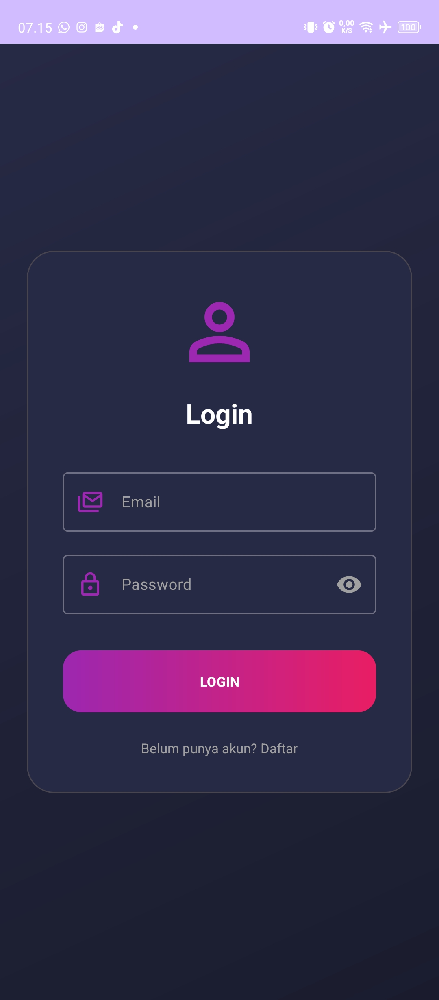
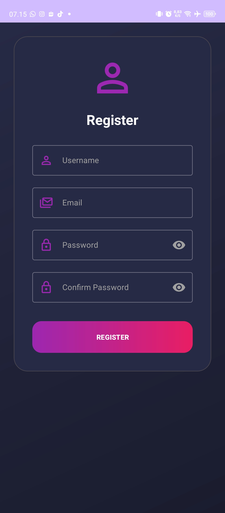
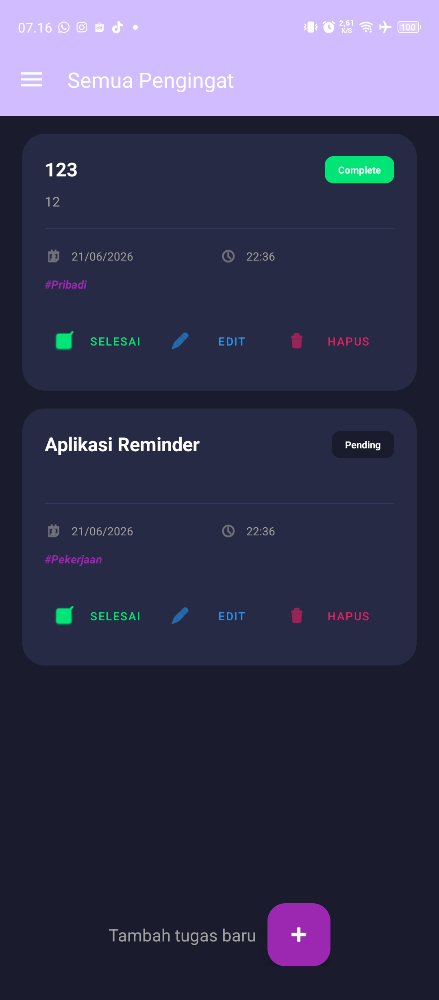
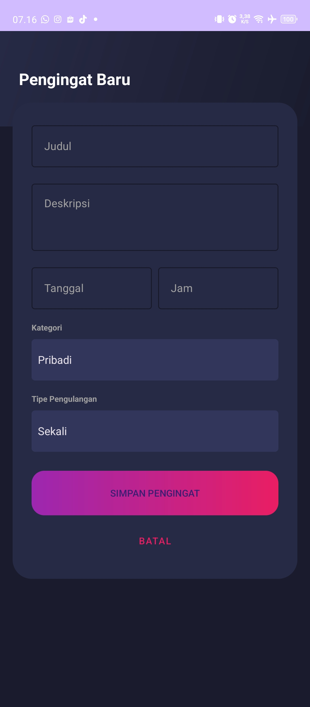
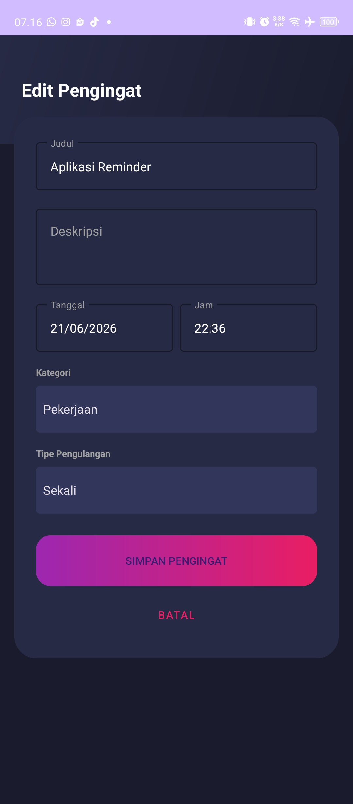
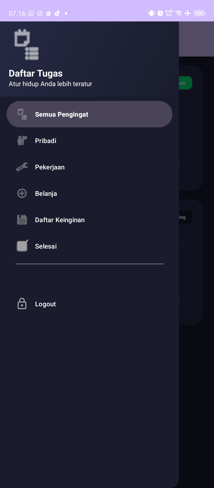

# 📱 Reminder App Android

Aplikasi pengingat tugas berbasis Android yang dikembangkan menggunakan Java dan SQLite. Aplikasi ini memungkinkan pengguna untuk mengelola tugas harian dengan fitur autentikasi pengguna, kategori tugas, serta manajemen reminder yang mudah digunakan.

## ✨ Fitur Utama

- 🔐 Login dan Register
- 👤 Session Management
- ➕ Menambah Reminder
- ✏️ Mengedit Reminder
- 🗑️ Menghapus Reminder
- ✅ Menandai Tugas Selesai
- 📂 Kategori Reminder
- 📅 Pengaturan Tanggal dan Waktu

## 🛠️ Teknologi yang Digunakan

- Java
- Android Studio
- SQLite Database
- RecyclerView
- Material Design Components
- SharedPreferences

## 📸 Screenshot

### Login



### Register



### Dashboard



### Tambah Reminder



### Edit Reminder



### Sidebar



## 📂 Struktur Project

```text
app/
├── src/
│   ├── main/
│   │   ├── java/com/example/reminderapp/
│   │   │   ├── LoginActivity.java
│   │   │   ├── RegisterActivity.java
│   │   │   ├── MainActivity.java
│   │   │   ├── AddEditReminderActivity.java
│   │   │   ├── DatabaseHelper.java
│   │   │   ├── SessionManager.java
│   │   │   └── ReminderAdapter.java
│   │   └── res/
│   │       ├── layout/
│   │       ├── drawable/
│   │       ├── menu/
│   │       └── values/
```

##  Cara Menjalankan

### Clone Repository

```bash
git clone https://github.com/USERNAME/NAMA-REPOSITORY.git
```

### Buka Android Studio

1. Open Project
2. Pilih folder project
3. Tunggu Gradle Sync selesai
4. Jalankan emulator atau perangkat Android
5. Klik Run ▶

##  Database

### Tabel User

| Field | Tipe |
|---------|---------|
| id | INTEGER |
| username | TEXT |
| email | TEXT |
| password | TEXT |

### Tabel Reminder

| Field | Tipe |
|---------|---------|
| id | INTEGER |
| title | TEXT |
| description | TEXT |
| date | TEXT |
| time | TEXT |
| category | TEXT |
| status | TEXT |

##  Pembelajaran

Melalui proyek ini dipelajari:

- Android Activity Lifecycle
- SQLite Database
- CRUD Operation
- RecyclerView
- User Authentication
- Session Management
- Material Design
- Mobile Application Development


